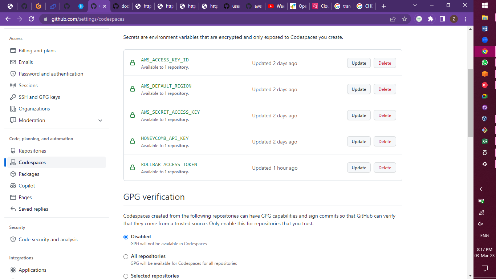
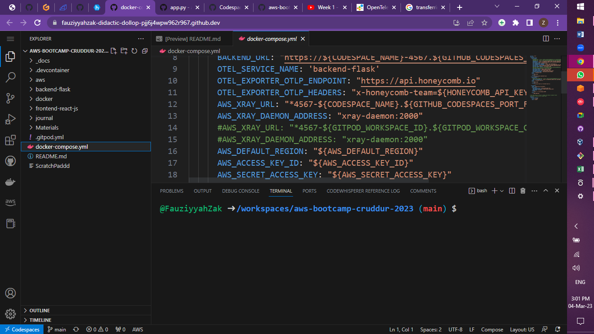
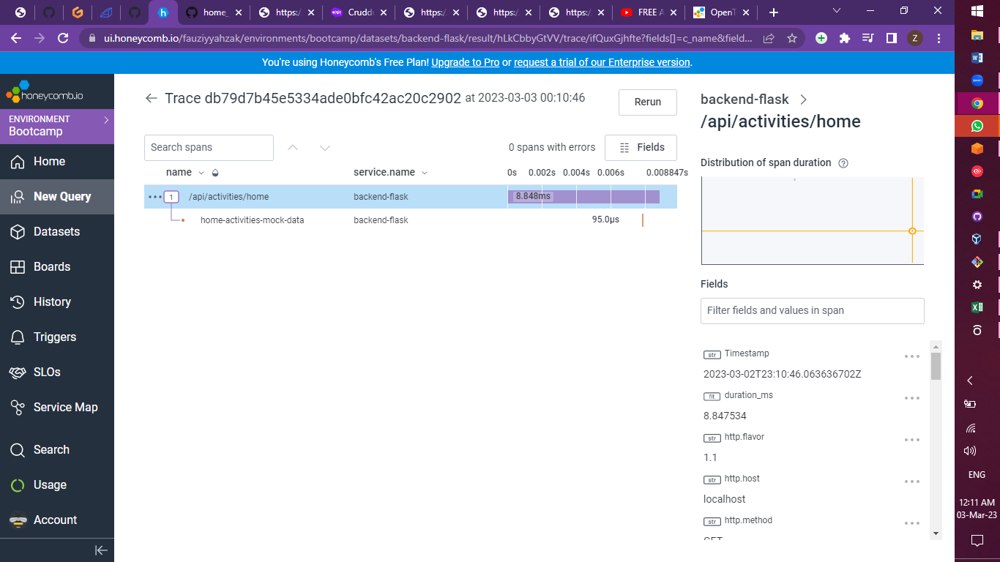
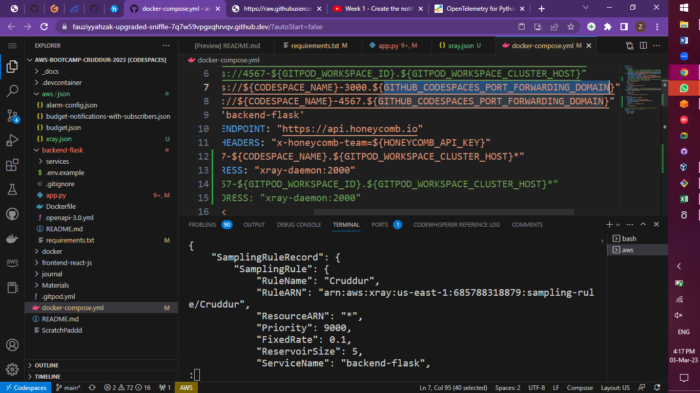

# Week 2 — Distributed Tracing
- As a user of codespaces, since I have run out Gitpod credits, I have saved my tokens and secrets in the Codespaces secret manager tab.
- 
- I have also commented out env vars config that are specifically for Gitpod and replaced with those of Codespaces.
- 
- I have instrumented Honeycomb with OTEL in my application.
- 
- I have also experimented the instrumentation of AWS Xray, but disabled it for spend consideration.
- 
- I have configured custom logger to send logs to cloudwatch.
- [CloudwatchLog](../Materials/CloudwatchLog.png)
- I have integrated rollbar.
- [RollbarTest](../Materials/RollbarTest.png)
- Copying codes from the resources to Codespaces somehow messes up my indentations, but I'm able to resolve them. I still currently have some lines under some of my codes indicating errors, but these are not affecting the functionality of my app.
